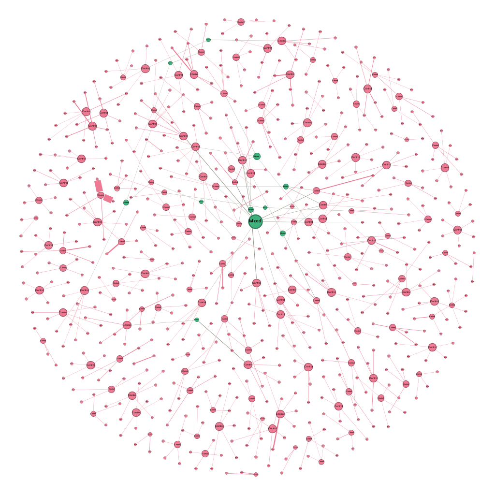
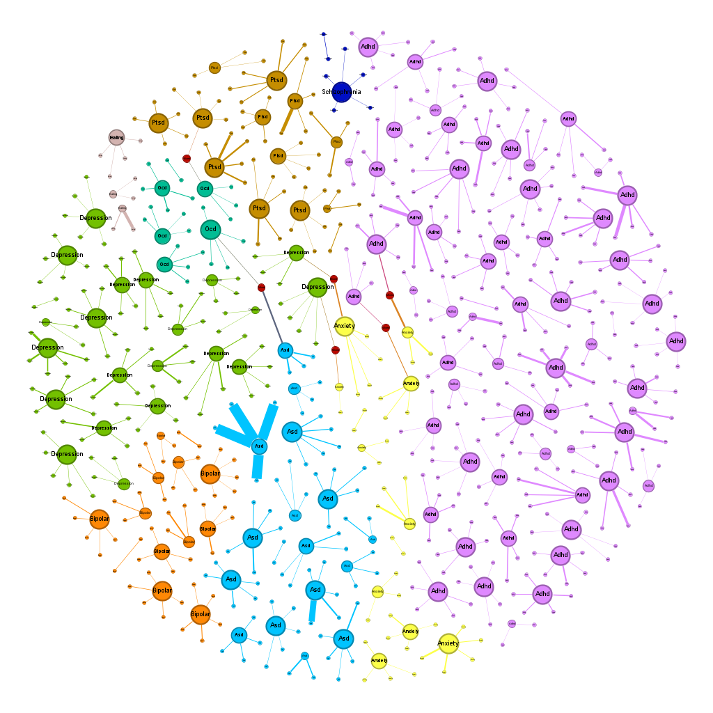
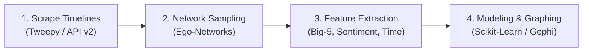

# Twitter Ego-Network Analysis

[](https://www.python.org/)
[](LICENSE)
[](report/Analyzing_Twitter_Follower_Homogeneity.pdf)
[](docs/ethics_and_compliance.md)

> **Analyzing Follower Homogeneity and Interaction Dynamics Among Diagnosed and Non-Diagnosed Social Media Cohorts**  
> *Author:* Tanjima Nasreen Jenia  
> *Technical Report:* [`report/Analyzing_Twitter_Follower_Homogeneity.pdf`](report/Analyzing_Twitter_Follower_Homogeneity.pdf)

---

## 📖 About the Project

This project conducts an empirical investigation into the interaction dynamics, behavioral traits, and follower network structures of online communities discussing mental health. Specifically, the study investigates whether social support networks on Twitter/X exhibit structural **follower homogeneity**—the tendency of users to form denser, tightly clustered interaction modules around shared health experiences.

### Core Research Questions
1. **Network Topology & Homogeneity:** Do users with self-reported mental health conditions form more tightly clustered ego-networks (higher modularity, lower diameter) compared to matched control peers?
2. **Temporal & Engagement Dynamics:** How do active hours of the day (e.g., late-night activity) and interaction frequency differ across specific psychiatric diagnoses?
3. **Psycholinguistic Profiling:** Can Big-5 personality trait extraction (OCEAN) and sentiment analysis capture behavioral patterns that distinguish diagnosed subgroups?

### Studied Cohorts (3,246 Users Across 10 Groups)
The dataset comprises longitudinal activity from **3,246 users** (1,543 diagnosed and 1,703 matched controls) across 9 clinical sub-groups:
* **ADHD** (Attention Deficit Hyperactivity Disorder)
* **Anxiety**
* **ASD** (Autism Spectrum Disorder)
* **Bipolar Disorder**
* **Depression**
* **Eating Disorders**
* **OCD** (Obsessive-Compulsive Disorder)
* **PTSD** (Post-Traumatic Stress Disorder)
* **Schizophrenia**
* **Control** (Baseline cohort without self-reported diagnoses)

---

## 🔬 Key Research Findings & Visualizations

### 1. Social Network Topology: Diagnosed vs. Control Ego-Networks
Using **Gephi** for community detection and network topology modeling, we analyzed 1,133 sampled ego-network nodes. The diagnosed group exhibited higher network modularity and a substantially more compact network diameter, demonstrating stronger follower homogeneity.

| Control Network (Baseline) | Diagnosed Network (Homogeneity) |
| :---: | :---: |
|  |  |
| *Sparse, dispersed community connections* | *Tightly clustered, dense interaction modules* |

#### Topological Network Metrics Comparison
| Metric | Control Network | Diagnosed Network | Takeaway |
| :--- | :---: | :---: | :--- |
| **Diameter** | **8** | **4** | Diagnosed network is twice as compact |
| **Average Path Length** | **3.2** | **1.7** | Information travels faster across diagnosed cohorts |
| **Modularity** | **0.928** | **0.969** | Higher division into distinct, cohesive sub-communities |
| **Identified Communities** | **132** | **143** | More distinct, condition-specific clusters |

---

### 2. Behavioral & Temporal Insights
* **Active Posting Period:** Diagnosed users displayed a statistically significant ($p < 0.001$, $\chi^2 = 21.827$) shift toward late-night and midnight posting (1:00 AM – 4:59 AM) compared to the control group.
* **Linguistic & Trait Correlations:** Point-biserial correlation analysis revealed statistically significant associations between self-reported diagnosis and higher Neuroticism ($r = 0.2098, p < 0.001$) and Conscientiousness trait scores ($r = 0.148, p < 0.001$).
* **Unsupervised Clustering:** Unsupervised K-Means and Agglomerative clustering repeatedly grouped users with ADHD, PTSD, Depression, and Schizophrenia into shared clusters based on interaction density and linguistic scores.

---

## 🏗️ Repository Architecture & Pipeline

```text
twitter-ego-network-analysis/
├── report/
│   └── Analyzing_Twitter_Follower_Homogeneity.pdf  # 20-page research technical report
├── docs/
│   ├── dataset_glossary.md    # 37 extracted features and descriptions
│   └── ethics_and_compliance.md # Compliance with X API ToS & data ethics
├── assets/                    # Figures and network visualizations
├── notebooks/                 # Sequential research pipeline
│   ├── 1_twitter_scraper.ipynb       # Twitter API v2 user & timeline collector
│   ├── 2_prepare_network_users.ipynb # Ego-network extraction & sampling
│   ├── 3_pipeline_features.ipynb     # Feature extraction (NLP, Big-5, sentiment)
│   └── 4_analysis_and_modeling.ipynb # Statistical tests, clustering & evaluation
├── data/
│   └── sample_features_anonymized.csv# Anonymized demo data for immediate testing
├── requirements.txt           # Python dependencies
├── LICENSE                    # MIT License
└── README.md
```

### Pipeline Flow



---

## 🚀 Quickstart

### 1. Prerequisites
* Python 3.8 or higher
* Jupyter Notebook or JupyterLab

### 2. Installation
```bash
# Clone the repository
git clone https://github.com/tanjimanasreen/twitter-ego-network-analysis.git
cd twitter-ego-network-analysis

# Create a virtual environment
python3 -m venv .venv
source .venv/bin/activate  # On Windows: .venv\Scripts\activate

# Install dependencies
pip install -r requirements.txt
```

### 3. Running the Analysis
Launch Jupyter to explore the statistical and machine learning workflows:
```bash
jupyter notebook notebooks/4_analysis_and_modeling.ipynb
```
*(The notebook runs directly with the provided anonymized demo dataset in `data/sample_features_anonymized.csv`.)*

### 4. Optional: Scraping New Timelines (Twitter API v2)
To fetch fresh timelines using `notebooks/1_twitter_scraper.ipynb`, set your Twitter API v2 Bearer Token in your environment:
```bash
export TWITTER_BEARER_TOKEN="your_x_api_bearer_token"
```

---

## 🔒 Data Privacy & Compliance

In strict adherence to the **X (Twitter) Developer Agreement & Policy** and ethical guidelines for research on sensitive health data:
* **No Raw Personal Data:** Raw tweet texts, user profile descriptions, and real screen names are **not distributed** in this repository.
* **Anonymization:** Provided sample datasets utilize masked synthetic identifiers (`anon_1001`, `anon_user_001`).
* For complete details on the anonymization protocol and academic reproduction, see [docs/ethics_and_compliance.md](docs/ethics_and_compliance.md) and [docs/dataset_glossary.md](docs/dataset_glossary.md).

---

## 📖 Citation

If you reference this work or utilize the pipeline in your research, please cite:

```bibtex
@techreport{jenia2023twitterhomogeneity,
  title={Analyzing Twitter Follower Homogeneity and Interactions among Diagnosed and Non-Diagnosed Users with Mental Health Conditions},
  author={Nasreen Jenia, Tanjima},
  year={2023},
  institution={Department of Computing Science, University of Alberta},
  type={Technical Report},
  url={https://github.com/tanjimanasreen/twitter-ego-network-analysis}
}
```

---

## 📄 License

This project is licensed under the MIT License - see the [LICENSE](LICENSE) file for details.